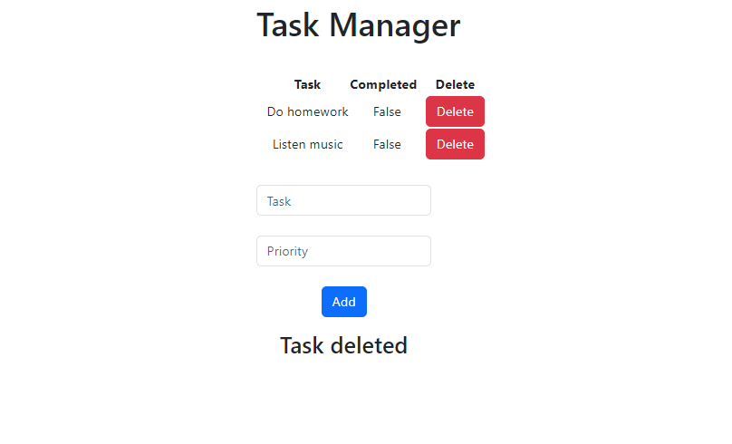

# Task_Manager_Django
Welcome to our efficient and user-friendly Task Management website, meticulously crafted using a powerful tech stack including Django, HTML, CSS, Bootstrap, SQL, and Python. Seamlessly blending form and function, our platform offers a streamlined way to organize and manage your tasks with ease.

### Key Features:

1. Intuitive Task Management:
Stay on top of your responsibilities with our intuitive task management interface. Easily add tasks, set due dates, and categorize them for better organization. With a clean and user-friendly design, managing your to-dos has never been this effortless.

2. Responsive Design with Bootstrap:
Experience seamless usability across devices thanks to our responsive design powered by Bootstrap. Whether you're accessing the platform from your desktop, tablet, or smartphone, the interface adapts to your screen size, ensuring an optimal user experience.

3. Task Addition:
Adding tasks is a breeze. Simply input task details including title, description, and due date through our user-friendly interface. You can prioritize tasks by setting due dates, helping you focus on what's important.

4. Task Deletion:
Need to remove a completed task or one that's no longer relevant? Our platform allows you to delete tasks with a single click. Say goodbye to clutter and keep your task list neat and organized.

5. Secure Database Management:
Behind the scenes, our SQL-powered database ensures robust data management and security. Your tasks are stored safely, allowing you to access them whenever you need, without worrying about data loss.

6. Python-Powered Backend:
The heart of our platform lies in the Python-powered Django backend. This dynamic combination enables seamless communication between the user interface and the database, ensuring smooth task management operations.

7. Customizable Interface:
Tailor the look and feel of the platform to match your preferences. With the flexibility of HTML, CSS, and Bootstrap, you can customize the interface to create an environment that suits your personal style.

8. User-Focused Experience:
Our platform is designed with users in mind. We understand the importance of a clutter-free and efficient task management experience, and we've worked hard to provide just that.

Whether you're a student juggling assignments, a professional managing projects, or simply someone looking to stay organized, our Task Management website built on Django, HTML, CSS, Bootstrap, SQL, and Python is your ultimate solution. Simplify your life and boost your productivity by effectively managing your tasks in a user-friendly digital environment. Try it today and experience the difference.

